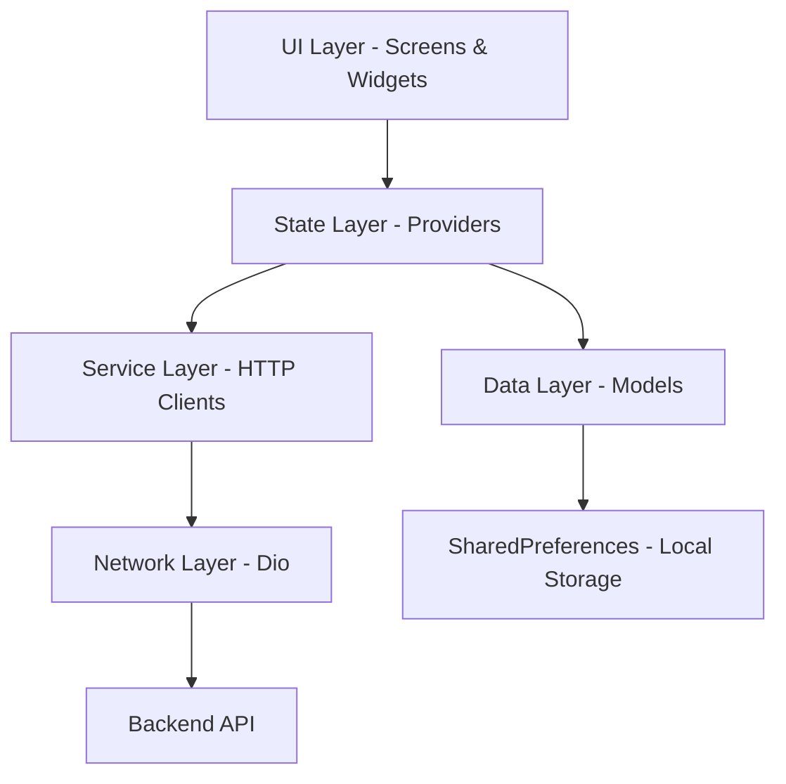
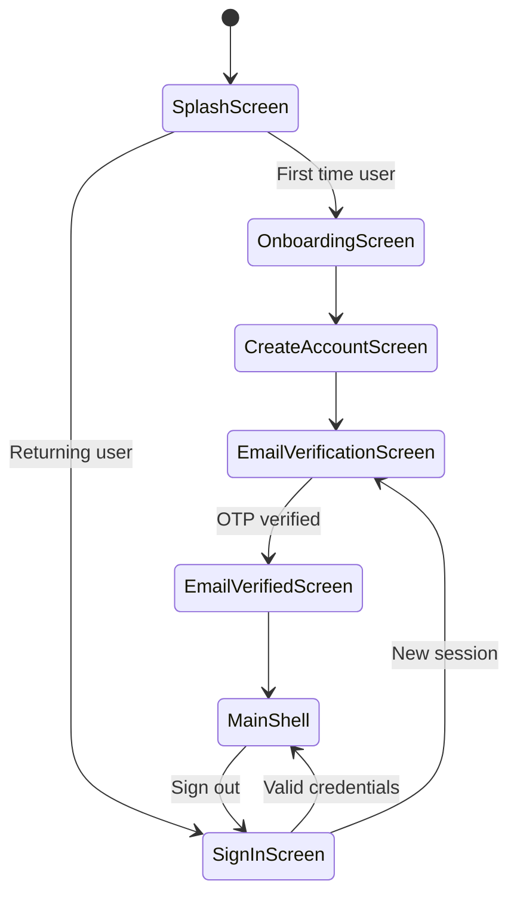
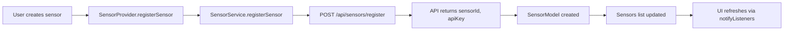
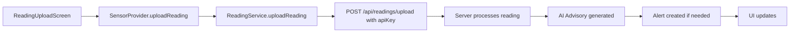

# AquaSense Technical Documentation

## Diátaxis Framework Documentation

---

## 1. TUTORIALS (Learning-Oriented Guides)

### 1.1 Setting Up the Development Environment

This tutorial guides new developers through setting up their local development environment for AquaSense.

#### Prerequisites
- Flutter SDK (channel stable, ≥ 3.10)
- Android Studio / Xcode (for emulators) or a physical device
- Git
- VS Code or Android Studio (recommended IDEs)

#### Step-by-Step Setup

**Step 1: Clone the Repository**
```bash
git clone https://github.com/<your-org>/aquasense.git
cd aquasense
```

**Step 2: Install Dependencies**
```bash
flutter pub get
```

**Step 3: Configure Environment Variables**
```bash
# For local development
--dart-define=API_BASE_URL=http://localhost:5000

# For staging
--dart-define=API_BASE_URL=https://staging.aquasense.com
```

**Step 4: Run the Application**
```bash
flutter run
```

#### Verifying Your Setup
- The app should launch to the Splash Screen
- Onboarding flow should display for first-time users
- You can sign in with demo credentials

---

### 1.2 Understanding the Project Structure

This tutorial helps developers understand the layered architecture of AquaSense.

#### Directory Structure Overview

```
lib/
├── core/                  # App-wide constants and theming
│   ├── constants/         # AppRoutes, configuration
│   ├── network/           # DioClient, API endpoints
│   ├── errors/            # ApiException
│   └── theme/             # AppColors, AppTextStyles, AppTheme
│
├── models/                # Plain Dart data classes
│   ├── sensor_model.dart  # SensorModel, enums
│   ├── user_model.dart    # UserModel with JSON serialization
│   ├── alert_model.dart   # AlertModel, AlertType
│   └── chat_message.dart  # Chat message models
│
├── providers/             # State management (Provider pattern)
│   ├── auth_provider.dart    # Authentication state
│   ├── sensor_provider.dart  # Sensor CRUD, wizard
│   ├── alert_provider.dart   # Alert management
│   └── chat_provider.dart    # AI chat state
│
├── services/              # HTTP service layer
│   ├── auth_service.dart     # Login, register
│   ├── sensor_service.dart   # Sensor API calls
│   └── alert_service.dart    # Alert API calls
│
├── repositories/          # Data access abstraction
│   └── sensor_repository.dart
│
├── screens/               # Full-page route destinations
│   ├── auth/              # Sign-in, registration, OTP
│   ├── home/              # MainShell, HomeScreen
│   ├── sensors/           # List, detail, AI advisory
│   ├── alerts/            # Alert list
│   ├── settings/          # User settings
│   └── ai_chat/           # AI conversational assistant
│
└── widgets/               # Reusable UI components
    ├── auth/              # Auth-specific widgets
    ├── common/            # AppButton, AppTextField
    ├── sensors/           # SensorCard, charts
    └── home/              # SearchBar, banners
```

#### Data Flow Pattern
```
Screen / Widget
      │  reads via Consumer<T> or context.watch<T>()
      ▼
  Provider (ChangeNotifier)
      │  calls methods on
      ▼
  Service (DioClient)
      │  makes HTTP requests to
      ▼
  Backend API
```

---

### 1.3 Creating Your First Sensor

This tutorial walks through adding a new sensor to the system.

#### Prerequisites
- User must be authenticated
- Navigate to the Sensors tab

#### Steps

1. **Tap the "+" Button**
   - Opens the Add Sensor wizard (5 steps)

2. **Step 1: Basic Information**
   - Select Parameter Type (pH, Turbidity, Dissolved Oxygen, Temperature, Conductivity)
   - Enter Sensor ID
   - Enter Sensor Name

3. **Step 2: Location & Source**
   - Enter Site location
   - Enter Specific Location
   - Optionally capture GPS coordinates
   - Select Data Source Type (IoT, Manual, Modbus, MQTT)

4. **Step 3: Configuration Settings**
   - Set Safe Operating Range
   - Configure Alert Threshold (Warning/Critical)

5. **Step 4: AI Preferences**
   - Enable/Disable AI Advisory
   - Set Sensitivity Level (Low/Medium/High)

6. **Step 5: Review & Submit**
   - Review all settings
   - Tap "Add Sensor" to register

---

## 2. HOW-TO GUIDES (Task-Oriented Guides)

### 2.1 How to Add a New API Endpoint

This guide shows how to add a new backend endpoint to the app.

**Step 1: Define the Endpoint**
Edit [`lib/core/network/api_endpoints.dart`](lib/core/network/api_endpoints.dart):
```dart
// Add new endpoint
static const newEndpoint = '/api/new/resource';

// For parameterized endpoints
static String newResourceById(int id) => '/api/new/resource/$id';
```

**Step 2: Create the Service Method**
Edit or create a new service in [`lib/services/`](lib/services/):
```dart
Future<List<NewDto>> getNewResources() async {
  final res = await _dio.get<List<dynamic>>(ApiEndpoints.newEndpoint);
  return res.data?.map(NewDto.fromJson).toList() ?? [];
}
```

**Step 3: Add to Provider**
```dart
class NewProvider extends ChangeNotifier {
  Future<void> loadNewResources() async {
    // Call service, update state, notifyListeners()
  }
}
```

**Step 4: Register Provider in main.dart**
```dart
ChangeNotifierProvider(create: (_) => NewProvider()),
```

---

### 2.2 How to Add a New Screen

This guide walks through adding a new screen to the app.

**Step 1: Create the Screen File**
Create `lib/screens/feature/new_screen.dart`:
```dart
class NewScreen extends StatelessWidget {
  const NewScreen({super.key});

  @override
  Widget build(BuildContext context) {
    return Scaffold(
      appBar: AppBar(title: const Text('New Screen')),
      body: const Center(child: Text('New Screen Content')),
    );
  }
}
```

**Step 2: Add Route**
Edit [`lib/core/constants/app_routes.dart`](lib/core/constants/app_routes.dart):
```dart
static const newScreen = '/new-screen';
```

**Step 3: Register Route**
Edit [`lib/main.dart`](lib/main.dart):
```dart
AppRoutes.newScreen: (_) => const NewScreen(),
```

**Step 4: Navigate to Screen**
```dart
Navigator.of(context).pushNamed(AppRoutes.newScreen);
```

---

### 2.3 How to Implement Form Validation

This guide shows best practices for form validation in AquaSense.

**Pattern Used in AquaSense:**

1. **Controller Setup**
```dart
final _emailController = TextEditingController();
bool _emailTouched = false;
```

2. **Validation Logic**
```dart
static final _emailRegex = RegExp(r'^[\w.+-]+@[\w-]+(?:\.[\w-]+)*\.[a-zA-Z]{2,}$');

String? get _emailError {
  if (!_emailTouched) return null;
  final v = _emailController.text.trim();
  if (v.isEmpty) return 'Email is required';
  if (!_emailRegex.hasMatch(v)) return 'Enter a valid email';
  return null;
}
```

3. **Error Display Widget**
```dart
class _FieldError extends StatelessWidget {
  final String? message;
  const _FieldError({required this.message});

  @override
  Widget build(BuildContext context) {
    if (message == null) return const SizedBox(height: 20);
    return Padding(
      padding: const EdgeInsets.only(top: 6),
      child: Row(
        children: [
          const Icon(Icons.error_outline, size: 14, color: AppColors.riskHighFg),
          const SizedBox(width: 4),
          Expanded(child: Text(message!, style: ...)),
        ],
      ),
    );
  }
}
```

---

### 2.4 How to Handle Authentication State

This guide explains managing auth state across the app.

**Key Concepts:**

1. **AuthProvider** ([`lib/providers/auth_provider.dart`](lib/providers/auth_provider.dart:44)) manages:
   - Session restoration on app start
   - Login/registration
   - OTP verification
   - Google Sign-In
   - Sign out

2. **Session Persistence**
```dart
// SharedPreferences keys
static const userJson = 'aquasense_user';
static const token = 'aquasense_token';
static const rememberMe = 'aquasense_remember_me';
static const verified = 'aquasense_email_verified';
```

3. **Using Auth in Widgets**
```dart
// Read auth state
final auth = context.watch<AuthProvider>();

// Check authentication
if (auth.isAuthenticated) {
  // Show authenticated content
}

// Access user data
final user = auth.user;
```

---

### 2.5 How to Add a New Widget

This guide shows how to create reusable widgets.

**Step 1: Create the Widget File**
Create `lib/widgets/feature/my_widget.dart`:
```dart
import 'package:flutter/material.dart';
import '../../core/theme/app_theme.dart';

class MyWidget extends StatelessWidget {
  final String title;
  final VoidCallback? onTap;

  const MyWidget({
    super.key,
    required this.title,
    this.onTap,
  });

  @override
  Widget build(BuildContext context) {
    return GestureDetector(
      onTap: onTap,
      child: Container(
        padding: const EdgeInsets.all(16),
        decoration: BoxDecoration(
          color: AppColors.white,
          borderRadius: BorderRadius.circular(12),
          border: Border.all(color: AppColors.borderColor),
        ),
        child: Text(title, style: AppTextStyles.titleMedium),
      ),
    );
  }
}
```

**Step 2: Export from Feature Index**
Add to `lib/widgets/feature/` export file or import directly.

**Step 3: Use in Screen**
```dart
import '../../widgets/feature/my_widget.dart';

// In build method
MyWidget(
  title: 'Hello',
  onTap: () => print('tapped'),
),
```

---

## 3. REFERENCE (Technical Descriptions)

### 3.1 API Endpoints

All API endpoints are centralized in [`lib/core/network/api_endpoints.dart`](lib/core/network/api_endpoints.dart).

#### Authentication Endpoints
| Endpoint | Method | Description |
|----------|--------|-------------|
| `/api/users/login` | POST | User login |
| `/api/users/register` | POST | User registration |

#### Sensor Endpoints
| Endpoint | Method | Description |
|----------|--------|-------------|
| `/api/sensors/register` | POST | Register new sensor |
| `/api/sensors/user/{userId}` | GET | Get user's sensors |
| `/api/sensors/analytics/{userId}` | GET | Get sensor analytics |

#### Reading Endpoints
| Endpoint | Method | Description |
|----------|--------|-------------|
| `/api/readings/upload` | POST | Upload sensor reading |

#### Alert Endpoints
| Endpoint | Method | Description |
|----------|--------|-------------|
| `/api/alerts/user/{userId}` | GET | Get user alerts |
| `/api/alerts/resolve/{alertId}` | PATCH | Resolve alert |

---

### 3.2 Model Reference

#### SensorModel ([`lib/models/sensor_model.dart`](lib/models/sensor_model.dart:151))
```dart
class SensorModel {
  final String id;                    // Local string ID
  final int? apiId;                   // Server-assigned ID
  final String? apiKey;               // For reading uploads
  final String name;                  // Display name
  final String location;              // Physical location
  final ParameterType parameter;       // What it measures
  final RiskLevel riskLevel;          // Current risk
  final SensorReading latestReading;  // Current value
  final ComplianceStatus complianceStatus;
  final AiAdvisory advisory;          // AI recommendations
  final bool aiAdvisoryEnabled;
  final String? gpsCoordinates;
  final DataSourceType dataSource;
  final RiskSensitivityLevel sensitivityLevel;
  final String safeRange;
  final AlertThreshold? alertThreshold;
}
```

#### UserModel ([`lib/models/user_model.dart`](lib/models/user_model.dart:10))
```dart
class UserModel {
  final int? userId;           // Server ID
  final String email;
  final String? username;
  final String? fullName;
  final String? organizationType;
  final String? token;         // JWT
  final bool isEmailVerified;
  final bool rememberMe;
}
```

#### AlertModel ([`lib/models/alert_model.dart`](lib/models/alert_model.dart:22))
```dart
class AlertModel {
  final String id;
  final int? apiId;
  final String title;
  final String description;
  final String reading;
  final String safeRange;
  final AlertType type;
  final String status;         // "active" | "resolved"
  final DateTime timestamp;
}
```

---

### 3.3 Enum Reference

#### RiskLevel ([`lib/models/sensor_model.dart`](lib/models/sensor_model.dart:2))
- `low` - Green, safe
- `medium` - Amber, caution
- `high` - Red, danger

#### ParameterType ([`lib/models/sensor_model.dart`](lib/models/sensor_model.dart:17))
- `pH` - pH level
- `turbidity` - NTU
- `dissolvedOxygen` - mg/L
- `temperature` - °C
- `conductivity` - µS/cm
- `other`

#### AlertType ([`lib/models/alert_model.dart`](lib/models/alert_model.dart:2))
- `alert` - Standard alert
- `recommendation` - AI recommendation
- `anomaly` - AI-detected anomaly
- `compliance` - Compliance violation

#### AuthStatus ([`lib/providers/auth_provider.dart`](lib/providers/auth_provider.dart:25))
- `initial` - App just started
- `loading` - Async operation in progress
- `pendingVerification` - Awaiting OTP
- `authenticated` - User logged in
- `error` - Operation failed

---

### 3.4 Provider Reference

#### AuthProvider ([`lib/providers/auth_provider.dart`](lib/providers/auth_provider.dart:44))
**State:**
- `status: AuthStatus`
- `user: UserModel?`
- `errorMessage: String?`
- `isAuthenticated: bool`

**Methods:**
- `restoreSession()` - Restore session from SharedPreferences
- `createAccount({...})` - Register new user
- `signIn({...})` - Login with credentials
- `verifyOtp(String)` - Verify OTP code
- `signInWithGoogle()` - Google Sign-In
- `signOut()` - Sign out

#### SensorProvider ([`lib/providers/sensor_provider.dart`](lib/providers/sensor_provider.dart:22))
**State:**
- `sensors: List<SensorModel>`
- `loadState: LoadState`
- `wizardStep: int`
- `form: AddSensorForm`

**Methods:**
- `loadSensors()` - Fetch sensors from API
- `registerSensor({...})` - Register new sensor
- `updateSensor(...)` - Update sensor
- `filteredSensors(scope)` - Get filtered list

#### AlertProvider ([`lib/providers/alert_provider.dart`](lib/providers/alert_provider.dart:13))
**State:**
- `alerts: List<AlertModel>`
- `filter: AlertFilter`
- `loadState: AlertLoadState`

**Methods:**
- `loadAlerts()` - Fetch alerts
- `resolveAlert(AlertModel)` - Resolve an alert
- `setFilter(AlertFilter)` - Filter alerts
- `setSearchQuery(String)` - Search alerts

---

### 3.5 Theme Reference

#### AppColors ([`lib/core/theme/app_theme.dart`](lib/core/theme/app_theme.dart:12))

| Color | Hex | Usage |
|-------|-----|-------|
| `teal` | 0xFF1B6B5A | Primary brand |
| `tealDark` | 0xFF0D4A3E | Pressed states |
| `tealLight` | 0xFF2A8A72 | Hover states |
| `riskHighFg` | 0xFFBE123C | High risk text |
| `riskHighBg` | 0xFFFFE4E6 | High risk background |
| `riskMediumFg` | 0xFFB45309 | Medium risk |
| `riskMediumBg` | 0xFFFEF9C3 | Medium risk |
| `riskLowFg` | 0xFF15803D | Low risk |
| `riskLowBg` | 0xFFDCFCE7 | Low risk |
| `background` | 0xFFFAFAFA | Scaffold bg |
| `surfaceGrey` | 0xFFF3F4F6 | Search bars |
| `borderColor` | 0xFFE5E7EB | Borders |
| `aiFab` | 0xFF7C2D8E | AI FAB button |

#### AppTextStyles ([`lib/core/theme/app_theme.dart`](lib/core/theme/app_theme.dart:85))
- `displayLarge` - Hero titles (26sp, bold)
- `headlineMedium` - Section headers (22sp, bold)
- `headlineSmall` - Card titles (18sp, bold)
- `titleLarge` - Auth titles (24sp, bold)
- `titleMedium` - List items (16sp, semibold)
- `bodyLarge` - Body text (15sp)
- `bodyMedium` - Secondary text (14sp)
- `bodySmall` - Captions (12sp)
- `labelLarge` - Field labels (14sp, semibold)
- `labelMedium` - Button text (16sp, semibold)

---

### 3.6 Widget Library Reference

#### Common Widgets ([`lib/widgets/common/`](lib/widgets/common/))
- `AppButton` - Primary action button with loading state
- `AppTextField` - Styled text input
- `AppLogo` - App logo display
- `AppBackButton` - Navigation back button
- `AppSkipButton` - Skip button for onboarding

#### Auth Widgets ([`lib/widgets/auth/`](lib/widgets/auth/))
- `AuthHeader` - Auth screen header with back button
- `AuthFooterLink` - Footer link for navigation
- `FieldLabel` - Input field label
- `GoogleSignInButton` - Google Sign-In with loading state

#### Sensor Widgets ([`lib/widgets/sensors/`](lib/widgets/sensors/))
- `SensorCard` - Sensor list item
- `SensorDetailHeader` - Detail screen header
- `RiskBadge` - Risk level indicator
- `TrendIcon` - Reading trend arrow

---

## 4. EXPLANATION (Conceptual Guides)

### 4.1 Architecture Overview

AquaSense follows a **layered architecture** with clear separation of concerns:



**Layer Responsibilities:**

1. **UI Layer** ([`lib/screens/`](lib/screens/), [`lib/widgets/`](lib/widgets/))
   - Present data to users
   - Handle user interactions
   - No business logic

2. **State Layer** ([`lib/providers/`](lib/providers/))
   - Manage application state
   - Contain business logic
   - Coordinate between services and UI

3. **Service Layer** ([`lib/services/`](lib/services/))
   - Handle HTTP requests
   - Transform API responses to models
   - No UI dependencies

4. **Network Layer** ([`lib/core/network/`](lib/core/network/))
   - Dio HTTP client configuration
   - Interceptors for auth
   - Error handling

5. **Data Layer** ([`lib/models/`](lib/models/))
   - Data models with serialization
   - Enums for type safety
   - Value objects

---

### 4.2 Authentication Flow

The app implements a multi-step authentication flow:



**Key Features:**
- JWT token-based authentication
- SharedPreferences for session persistence
- OTP verification for email confirmation
- Google Sign-In support
- "Remember Me" functionality

---

### 4.3 State Management Approach

AquaSense uses the **Provider** package for state management:

**Why Provider?**
- Simple to learn and use
- Built into Flutter ecosystem
- Works well with ChangeNotifier pattern
- Easy to test

**Key Patterns:**

1. **ChangeNotifierProvider**
```dart
ChangeNotifierProvider(create: (_) => AuthProvider()),
```

2. **ProxyProvider** (for dependent state)
```dart
ChangeNotifierProxyProvider<AuthProvider, SensorProvider>(
  create: (ctx) => SensorProvider(ctx.read<AuthProvider>().user),
  update: (_, auth, previous) => previous!..updateUser(auth.user),
),
```

3. **Consumer Widget**
```dart
Consumer<AuthProvider>(
  builder: (context, auth, _) {
    return Text(auth.user?.email ?? 'Not logged in');
  },
),
```

4. **context.watch<T>()**
```dart
final auth = context.watch<AuthProvider>();
```

---

### 4.4 Error Handling Strategy

The app implements a centralized error handling approach:

**ApiException** ([`lib/core/errors/api_exception.dart`](lib/core/errors/api_exception.dart))
```dart
class ApiException implements Exception {
  final int? statusCode;
  final String message;
  final String? displayMessage;
  
  // Error codes map to user-friendly messages
}
```

**Error Interceptor** ([`lib/core/network/dio_client.dart`](lib/core/network/dio_client.dart:100))
- Catches all Dio errors
- Converts to ApiException
- Extracts server error messages

**Error Display Pattern**
```dart
if (auth.errorMessage != null)
  Padding(
    child: Text(
      auth.errorMessage!,
      style: TextStyle(color: AppColors.riskHighFg),
    ),
  ),
```

---

### 4.5 Theming System

AquaSense uses a centralized theming approach:

**Design Rules:**
1. No raw `Color(0x...)` in widget files
2. All colors defined in `AppColors`
3. All text styles defined in `AppTextStyles`
4. Theme applied globally via `MaterialApp`

**Theme Application**
```dart
MaterialApp(
  theme: AppTheme.theme,
  // ...
)
```

**Theme Benefits:**
- Consistent look and feel
- Easy to implement dark mode
- Single source of truth for design tokens

---

### 4.6 Data Flow for Sensors

**Sensor Data Lifecycle:**



**Reading Upload Flow:**


---

### 4.7 Search Implementation

The app implements **scoped search** for sensors:

**Why Scoped Search?**
- Home and Sensors tabs have independent search
- User can search different terms in each tab
- State doesn't conflict between screens

**Implementation:**
```dart
enum SensorSearchScope { home, sensors }

// In provider
final Map<SensorSearchScope, String> _queries = {};

void setSearchQuery(String query, {required SensorSearchScope scope}) {
  _queries[scope] = query.toLowerCase();
  notifyListeners();
}

List<SensorModel> filteredSensors({required SensorSearchScope scope}) {
  final q = _queries[scope] ?? '';
  if (q.isEmpty) return _sensors;
  return _sensors.where((s) =>
    s.id.toLowerCase().contains(q) ||
    s.name.toLowerCase().contains(q) ||
    s.location.toLowerCase().contains(q)
  ).toList();
}
```

---

### 4.8 Route Management

The app uses named routes with a centralized route definitions:

**Route Configuration** ([`lib/core/constants/app_routes.dart`](lib/core/constants/app_routes.dart))
```dart
class AppRoutes {
  static const splash = '/';
  static const onboarding = '/onboarding';
  static const signIn = '/sign-in';
  static const home = '/home';
  // ... more routes
}
```

**Route Registration** ([`lib/main.dart`](lib/main.dart:64))
```dart
routes: {
  AppRoutes.splash: (_) => const SplashScreen(),
  AppRoutes.home: (_) => const MainShell(),
  // ...
}
```

**Navigation Patterns:**
```dart
// Push new screen
Navigator.of(context).pushNamed(AppRoutes.sensorDetail, arguments: sensor);

// Replace current screen
Navigator.of(context).pushReplacementNamed(AppRoutes.home);

// Push and remove until
Navigator.of(context).pushNamedAndRemoveUntil(
  AppRoutes.home,
  (route) => false,
);
```

---

### 4.9 AI Advisory System

The AI Advisory feature provides contextual insights:

**Advisory Data Structure:**
```dart
class AiAdvisory {
  final String headline;           // Short title
  final String impactExplanation; // Detailed explanation
  final List<String> recommendedActions; // Action items
  final String impactNotes;        // Regulatory notes
}
```

**Trigger Points:**
- New sensor reading uploaded
- Threshold breach detected
- Anomaly detected in trends
- User requests AI chat

---

## 5. APPENDICES

### Appendix A: File Structure Summary

```
aquasense/
├── lib/
│   ├── main.dart                    # App entry point
│   ├── core/
│   │   ├── constants/app_routes.dart
│   │   ├── errors/api_exception.dart
│   │   ├── network/
│   │   │   ├── api_endpoints.dart
│   │   │   └── dio_client.dart
│   │   └── theme/app_theme.dart
│   ├── models/
│   │   ├── alert_model.dart
│   │   ├── chat_message.dart
│   │   ├── onboarding_model.dart
│   │   ├── sensor_model.dart
│   │   ├── settings_item.dart
│   │   └── user_model.dart
│   ├── providers/
│   │   ├── alert_provider.dart
│   │   ├── auth_provider.dart
│   │   ├── chat_provider.dart
│   │   ├── onboarding_provider.dart
│   │   ├── reading_provider.dart
│   │   └── sensor_provider.dart
│   ├── repositories/
│   │   └── sensor_repository.dart
│   ├── screens/
│   │   ├── ai_chat/
│   │   ├── alerts/
│   │   ├── auth/
│   │   ├── home/
│   │   ├── onboarding/
│   │   ├── readings/
│   │   ├── sensors/
│   │   ├── settings/
│   │   └── splash/
│   ├── services/
│   │   ├── alert_service.dart
│   │   ├── auth_service.dart
│   │   ├── google_auth_service.dart
│   │   ├── location_service.dart
│   │   ├── reading_service.dart
│   │   └── sensor_service.dart
│   └── widgets/
│       ├── ai_chat/
│       ├── alerts/
│       ├── auth/
│       ├── common/
│       ├── home/
│       └── sensors/
├── pubspec.yaml
├── analysis_options.yaml
└── README.md
```

### Appendix B: Key Dependencies

| Package | Version | Purpose |
|---------|---------|---------|
| provider | ^6.1.1 | State management |
| dio | ^5.4.0 | HTTP client |
| shared_preferences | ^2.0.15 | Local storage |
| google_sign_in | ^6.2.1 | Google auth |
| geolocator | ^11.0.0 | GPS location |
| permission_handler | ^11.3.0 | Permissions |
| flutter_svg | ^2.2.3 | SVG rendering |
| google_fonts | ^8.0.2 | Typography |

### Appendix C: SharedPreferences Keys

| Key | Type | Purpose |
|-----|------|---------|
| `aquasense_user` | String | UserModel JSON |
| `aquasense_token` | String | JWT token |
| `aquasense_remember_me` | bool | Remember me flag |
| `aquasense_email_verified` | bool | Email verified |

---
